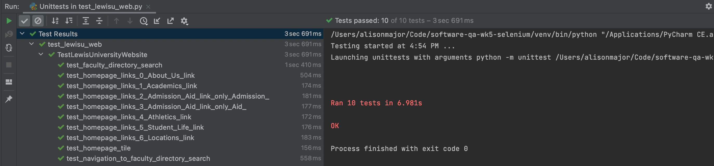

# Lab 5: Automating UAT with Selenium

In this lab, we will be using the Selenium testing framework to develop automated user acceptance tests. Selenium is 
an open-source web-based automation tool, which can be used to automate various aspects of the User Acceptance Testing 
(UAT) effort. Selenium provides capability to instantiate a browser, simulate user interaction, and test the html 
output.

## Python test cases.

- Tile of the homepage must include “Lewis University”
- Home page must include the following links
  - About Us
  - Academics
  - Admission and Aid
  - Athletics
  - Student Life
  - Locations
- User must be able to navigate to the Faculty/Staff directory from the homepage
- User must be able to search for “Omari” and get results.

Please see [test_lewisu_web.py](../tests/test_lewisu_web.py) 

### Tile of the homepage must include “Lewis University”

```python
def test_homepage_tile(self):
    driver = self.driver
    driver.get("https://www.lewisu.edu")
    self.assertIn("Lewis University", driver.title)

    # Does the logo image exist?
    logo_image_element = driver.find_element_by_css_selector('img.LogoImg')
    self.assertTrue(logo_image_element)

    # Does the logo image refer to the expected image file?
    self.assertEqual("https://www.lewisu.edu/images/logo.png", logo_image_element.get_attribute('src'))
```

### Home page must include navigation links

```python
@parameterized.expand([
    ("About Us link", "About Us"),
    ("Academics link", "Academics"),
    ("Admission & Aid link (only 'Admission')", "Admission"),
    ("Admission & Aid link (only 'Aid')", "Aid"),
    ("Athletics link", "Athletics"),
    ("Student Life link", "Student Life"),
    ("Locations link", "Locations")
])
def test_homepage_links(self, name, link_text):
    driver = self.driver
    driver.get("https://www.lewisu.edu")

    # Confirm that link is clickable (will raise exception if it is not!)
    driver.find_element_by_partial_link_text(link_text).click()

    # Page source includes the text for the link.
    assert link_text in driver.page_source
```

### User must be able to navigate to the Faculty/Staff directory from the homepage

```python
def test_navigation_to_faculty_directory_search(self):
    driver = self.driver
    driver.get("https://www.lewisu.edu")

    # Navigate to Faculty / Staff page
    faculty_staff_link = driver.find_element_by_link_text("Fac/Staff")
    faculty_staff_link.click()

    # Navigate to the Faculty & Staff Directory
    faculty_directory_link = driver.find_element_by_link_text("Faculty/Staff Directory")
    faculty_directory_link.click()

    # Check page title to confirm correct page.
    self.assertIn("Lewis University | Faculty/Staff Directory", driver.title)

    faculty_directory_page_header = driver.find_element_by_css_selector('h4.SubTitle')
    self.assertEqual("Faculty/Staff Directory".lower(), faculty_directory_page_header.text.lower())
```

### User must be able to search for “Omari” and get results.

```python
def test_faculty_directory_search(self):
    driver = self.driver
    driver.get("https://www.lewisu.edu/facstaffdirectory/FacStaffDir2.htm")

    # Look for the search input field
    elem = driver.find_element_by_name("last")

    # Type in "Omari" and submit
    elem.send_keys("Omari")
    elem.send_keys(Keys.RETURN)

    # Assert that you get back a record for Dr. Omari.
    assert "No records" not in driver.page_source
    assert "Omari, Dr. Safwan" in driver.page_source
    assert "Associate Professor" in driver.page_source
```

## Screenshots

Screenshots showing that all test cases run successfully.

